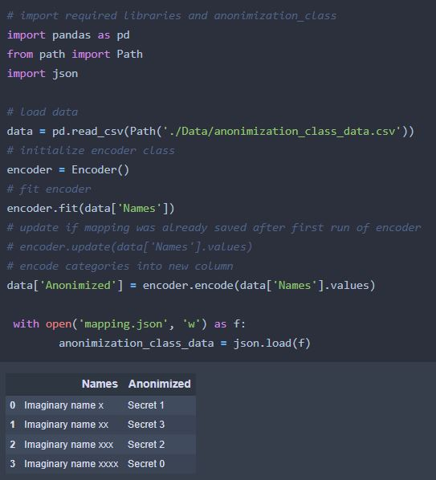

# Blog Post
---

This repository is ment for sharing utility codes written in python for Data Analysis or Data Science purpose. If any utility code requires data than it will be in Data folder, all codes can run smoothly by creating seprate envirnoment using requirements.text file.

## 1. Anonymized Function
---
This function takes dataframe and target column name which need to be anonymized as an input and generate secret names. In data science projects, lot of time we need to protect personal information of customers like their name or address without loosing valueable information. This function takes any categorical column and generate a unique string for that, for example names like Ajay, Manoj and Afzal converts into "secret 0", "secret 1" and "secret 2".

This function will take care of ordering as well so that Ajay, Manoj and Afzal will always have "secret 0", "secret 1" and "secret 2" as anonymized names even if new names introduced in data. Note: this function will generate json file which will be used to store history.

***Usage***
 

